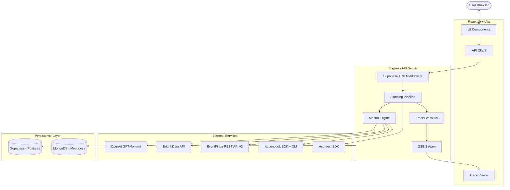
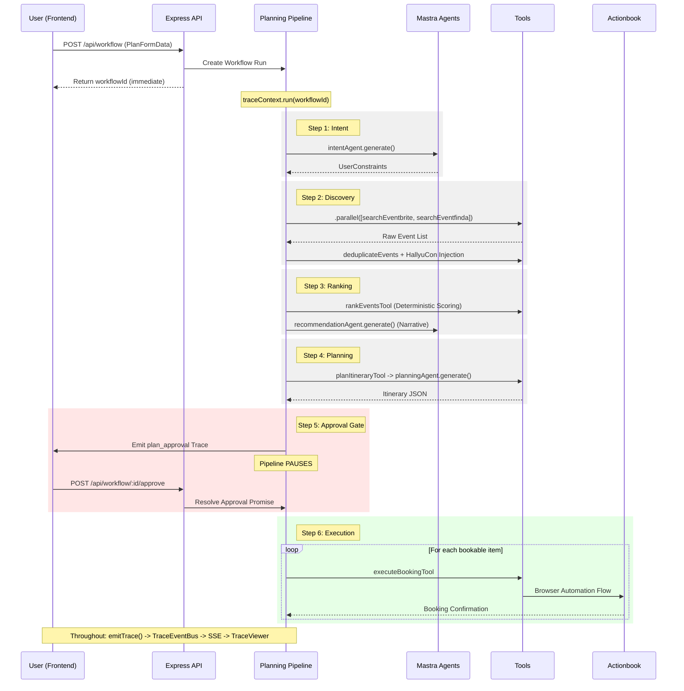
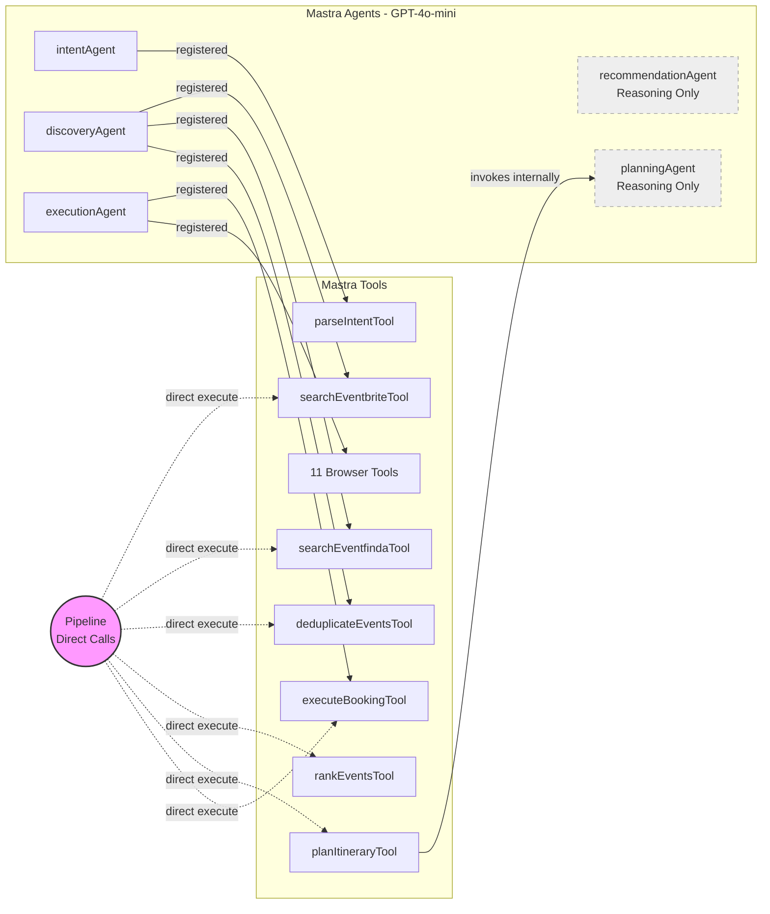
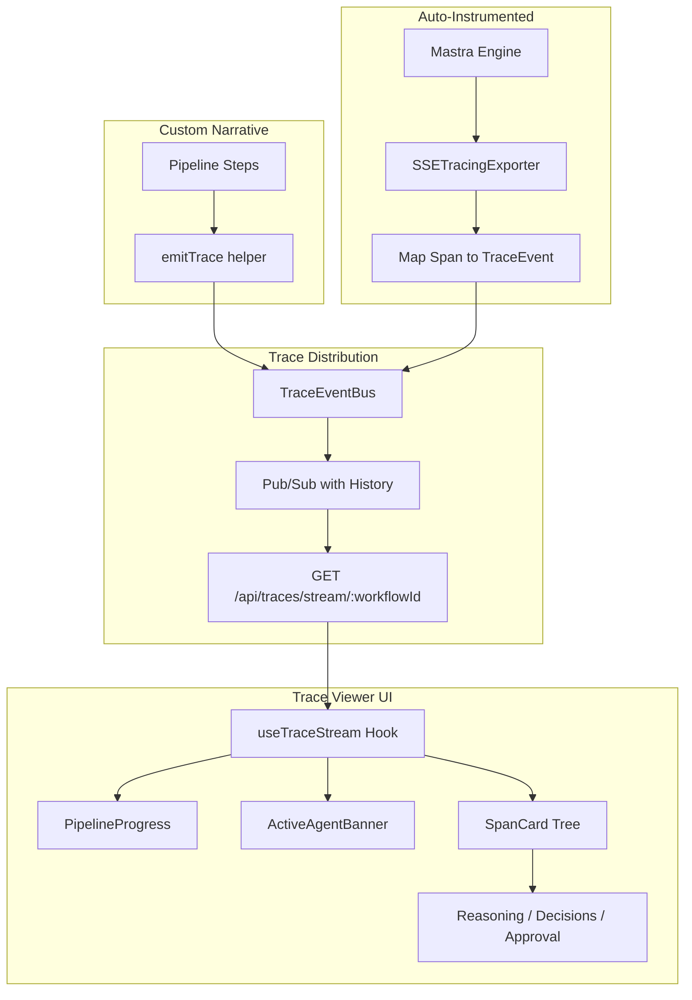
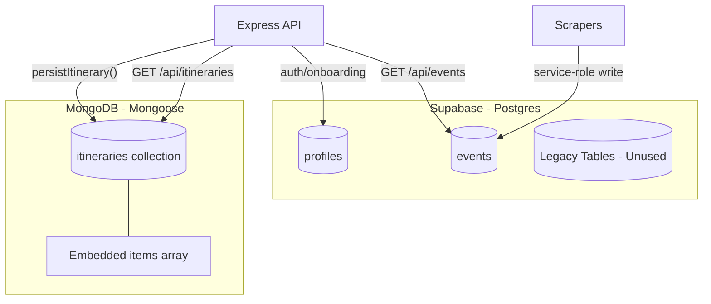
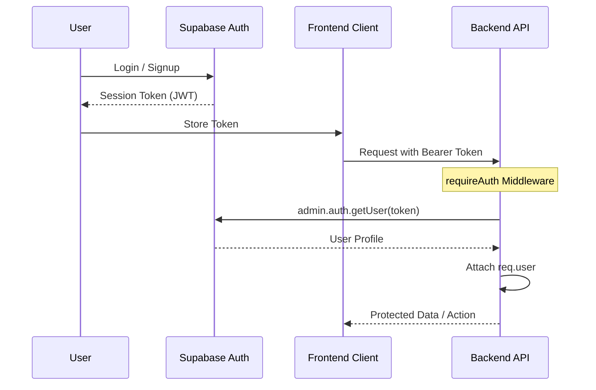
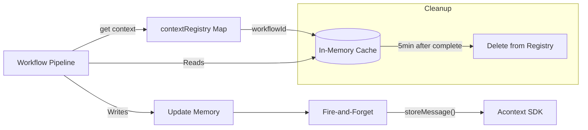
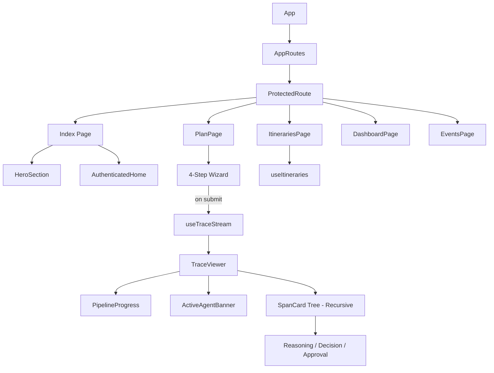

# Architecture — Agentic Itinerary Planner

The Agentic Itinerary Planner is an autonomous logistics system that discovers, ranks, plans, and executes real-world event itineraries. It uses a multi-agent orchestration layer to transform natural language intent into verified bookings with full explainability through a real-time tracing system.

## High-Level System Architecture

The system follows a modern web architecture with a React frontend communicating via a REST API to an Express backend. The backend orchestrates a network of Mastra agents and tools, integrating with multiple external services for event discovery, LLM reasoning, and browser-based execution.

## Agent Pipeline Flow

The planning pipeline is an asynchronous workflow that progresses through intent understanding, discovery, ranking, and planning before pausing for human approval. Once approved, it proceeds to automated execution using real browser interaction.

## Agent & Tool Dependency Map

This map illustrates the relationship between Mastra agents and their associated tools. While agents use tools for LLM-driven reasoning, the pipeline frequently calls tools directly to ensure deterministic behavior and higher performance.

## Real-Time Tracing Data Flow

The tracing system captures both high-level narrative events from the pipeline and low-level technical spans from the Mastra engine. These are merged into a unified stream that provides the frontend with a comprehensive view of the agent's thought process.

## Database Architecture

A dual-database approach leverages Supabase for identity and structured event caching, while MongoDB handles the flexible, document-based nature of completed itineraries and their embedded snapshots.

## Authentication Flow

Authentication is managed client-side by the Supabase SDK, with the backend performing stateless JWT verification. This ensures all protected resources are secured by user-scoped identity throughout the system.

## Context Manager (Write-Through Cache)

The Context Manager provides a durable yet high-performance state management solution for workflows. It prioritizes zero-latency in-memory access for the active pipeline while ensuring every state change is asynchronously persisted to Acontext.

## Frontend Component Architecture

The frontend is structured around a guided wizard flow that transitions into a real-time observation mode during planning. It uses a recursive component structure to render the hierarchical trace tree emitted by the backend.

## Key Design Decisions

- **SSE over WebSocket**: Chose Server-Sent Events for real-time tracing because the data flow is primarily one-directional (server to client), it's simpler to implement, has native browser support with automatic reconnection, and avoids the overhead of a full duplex connection.
- **Dual Database Strategy**: Used Supabase (Postgres) for its robust authentication and RLS policies, while using MongoDB for itinerary persistence to easily store complex, nested document structures with denormalized event snapshots without rigid schema migrations.
- **Direct Tool Execution**: The pipeline calls specific tools (discovery, ranking, booking) directly rather than through an agent's reasoning loop. This ensures deterministic performance, avoids LLM hallucinations for known logic, and significantly reduces latency and token cost.
- **Write-Through Cache for Context**: Implemented a pattern where reads always hit in-memory storage for zero-latency, while writes are asynchronously backed up to Acontext. This ensures the pipeline is never slowed down by external persistence calls while remaining durable.
- **HallyuCon Injection**: To ensure a reliable demo experience, the system injects a "HallyuCon" event (a real free Eventbrite RSVP) into the discovery results. This guarantees that a bookable, free-of-charge event is always available for the execution agent to demonstrate the full browser automation flow.
